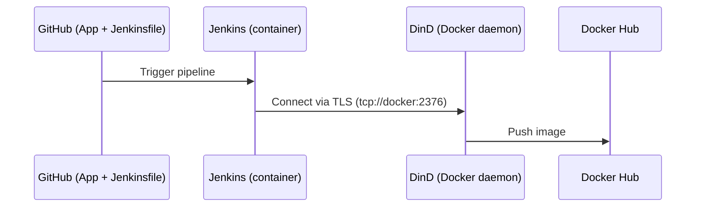

# Project2-Compose

This repository contains the Docker Compose stack for **Jenkins** and **Docker-in-Docker (DinD)** used in my Secure DevOps Assignment 2. Jenkins runs in a container and connects to a secure Docker daemon exposed by DinD over TLS at `tcp://docker:2376`. The stack is designed for local use and supports a CI/CD pipeline for a Node.js sample application.

---

## 1) Architecture

Key points:
* Jenkins and DinD run on the same user-defined Docker network.
* The `jenkins_home` named volume is mounted **in both** services so DinD can access the Jenkins workspace path when we mount it inside build containers. This improves reliability for `docker run` and `docker build` steps.

---

## 2) Prerequisites

* Docker Engine **24.x** or later
* Docker Compose v2 (`docker compose` command)
* Internet access to pull images and plugins

Recommended versions used in my setup:

* Jenkins LTS (JDK 11)
* Node **16** for build/test containers
* Snyk CLI for dependency scanning (configured to fail on High/Critical)

---

## 3) Quick Start

Start the stack:

```bash
docker compose up -d
```

Check status:

```bash
docker compose ps
```

Fetch the initial Jenkins admin password:

```bash
docker logs jenkins | head -n 40
```

Open Jenkins:

```
http://localhost:8080
```

Stop the stack:

```bash
docker compose down
```

---

## 4) First-Time Jenkins Setup (one-time)

1. **Login** with the initial password (see command above).
2. **Install plugins** (Git is included; others optional):

   * Warnings Next Generation (optional)
   * Audit Trail (optional)
3. **Security hardening**:

   * Disable **Anonymous** access (Matrix-based or similar).
   * Create a **non-admin** user for pipeline runs (principle of least privilege).
4. **Credentials** (Manage Jenkins → Credentials → Global):

   * `dockerhub` → *Username with password* (for Docker Hub push).
   * `snyk_token` → *Secret text* (your Snyk API token).

---

## 5) How this stack is organised

```
Project2-Compose/
├─ docker-compose.yml
└─ README.md
```

* `docker-compose.yml` defines two services: **jenkins** and **dind**, one network, and several named volumes.

---

## 6) Services (summary)

| Service   | Purpose                          | Ports                                 | Notes                                                                      |
| --------- | -------------------------------- | ------------------------------------- | -------------------------------------------------------------------------- |
| `jenkins` | Jenkins LTS controller           | `8080/tcp` (UI), `50000/tcp` (agents) | Talks to DinD via `DOCKER_HOST=tcp://docker:2376` with TLS certs mounted.  |
| `dind`    | Docker daemon (Docker-in-Docker) | n/a (internal)                        | Runs in privileged mode; provides TLS certs and the Docker API to Jenkins. |


---

## 7) Volumes (summary)

| Volume                | Mounted at          | Used by            | Why it matters                                                              |
| --------------------- | ------------------- | ------------------ | --------------------------------------------------------------------------- |
| `jenkins_home`        | `/var/jenkins_home` | jenkins, dind      | Persists Jenkins config and workspaces; shared so DinD sees the same paths. |
| `docker_certs_ca`     | `/certs/ca`         | dind               | CA storage for DinD TLS.                                                    |
| `docker_certs_client` | `/certs/client`     | jenkins (ro), dind | Client certs so Jenkins can connect to DinD securely.                       |
| `docker_cache`        | `/var/lib/docker`   | dind               | Speeds up image builds by caching layers.                                   |


---

## 8) Verify Connectivity (optional checks)

* From Jenkins (a freestyle job), run:

  ```bash
  docker --version
  ```

  You should see a valid Docker CLI version.

* In your pipeline, mount the workspace into a Node 16 container:

  ```bash
  docker run --rm -v "$WORKSPACE":/app -w /app node:16 node -v
  ```

  This confirms DinD can access the Jenkins workspace path.

---

## 9) Security Notes

* Anonymous access is disabled.
* A non-admin user runs the pipeline.
* Secrets (Docker Hub and Snyk token) are stored in **Jenkins Credentials** and are never hard-coded in the Jenkinsfile.
* DinD is reachable only on the internal Docker network using TLS (`DOCKER_TLS_VERIFY=1`).

---

## 10) Common Commands

Recreate containers after editing `docker-compose.yml`:

```bash
docker compose up -d --force-recreate
```

Inspect volumes (example for `jenkins_home`):

```bash
docker volume inspect project2-compose_jenkins_home
```

View DinD logs (useful during troubleshooting):

```bash
docker logs dind --tail=100
```

---

## 11) Troubleshooting

* **Workspace not visible inside build containers**
  Ensure `jenkins_home` is mounted in **both** services (Jenkins and DinD). This lets DinD bind-mount the Jenkins workspace correctly when you run `docker run -v "$WORKSPACE":/app ...`.

* **Snyk CLI cannot find token**
  Create a *Secret text* credential with ID `snyk_token` and pass it via `withCredentials`. Do not paste tokens in the Jenkinsfile.

* **Slow first security scan (if using OWASP DC)**
  The first run downloads a large CVE database. Use a persistent cache path (outside the workspace) if you switch to OWASP DC. For Snyk CLI, this is not required.

